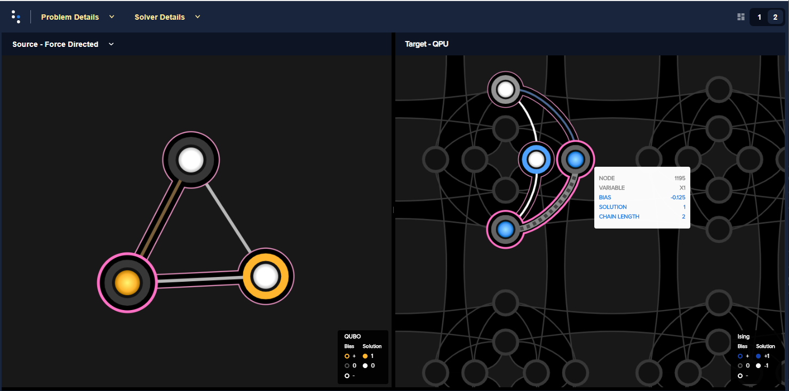

.. intro_inspector:

============
Introduction
============

``dwave-inspector`` provides a graphic interface for examining D-Wave quantum computers'
problems and answers. As described in the
`Ocean documentation's Getting Started <https://docs.ocean.dwavesys.com/en/latest/overview/solving_problems.html>`_,
the D-Wave system solves problems formulated as binary quadratic models (BQM) that are
mapped to its qubits in a process called minor-embedding. Because the way you choose to
minor-embed a problem (the mapping and related parameters) affects solution quality,
it can be helpful to see it.

For example, embedding a K3 fully-connected graph, such as the
`Boolean AND gate example <https://docs.ocean.dwavesys.com/en/latest/examples/and.html>`_
into a D-Wave 2000Q, with its Chimera topology,
requires representing one of the three variables with a "chain" of two physical qubits:

  The AND gate's original BQM is represented on the left; its embedded representation,
  on the right, shows a two-qubit chain of qubits 1195 and 1199 for one variable.

The problem inspector shows you your chains at a glance: you see lengths, any breakages,
and physical layout.

.. _examples_inspector:

Usage and Examples
==================

Import the problem inspector to enable it\ [#]_ to hook into your problem submissions.

.. [#]
   Importing the problem inspector activates for the session the capture of
   data such as problems sent to the QPU and returned responses, relevant details of
   minor-embedding, and warnings. The recommended workflow is to import it at the
   start of your coding session as is typical for Python packages (it is also
   possible, but less convenient, to specify in the submission that
   data such as embedding be returned with the response).

Use the ``show()`` method to visualize the embedded problem, and optionally the
logical problem, in your default browser.

* `Inspecting an Embedded Problem`_
* `Inspecting a Logical Problem`_

Inspecting an Embedded Problem
------------------------------

.. include:: README.rst
  :start-after: example-start-marker
  :end-before: example-end-marker

Inspecting a Logical Problem
----------------------------

This example visualizes a problem specified logically and then automatically
minor-embedded by Ocean's ``EmbeddingComposite``. For illustrative purposes
it sets a weak ``chain_strength`` to show broken chains.

.. code-block:: python

    import dimod
    import dwave.inspector
    from dwave.system import DWaveSampler, EmbeddingComposite

    # Define problem
    bqm = dimod.BQM.from_ising({}, {'ab': 1, 'bc': 1, 'ca': 1})

    # Get sampler
    sampler = EmbeddingComposite(DWaveSampler(solver=dict(qpu=True)))

    # Sample with low chain strength
    sampleset = sampler.sample(bqm, num_reads=1000, chain_strength=0.1)

    # Inspect
    dwave.inspector.show(sampleset)

.. figure:: _images/logical_problem.png
  :align: center
  :figclass: align-center

  The logical problem, on the left, shows that the value for variable ``b`` is based on a broken chain; the embedded problem, on the right, highlights the broken chain (its two qubits have different values) in bold red.
